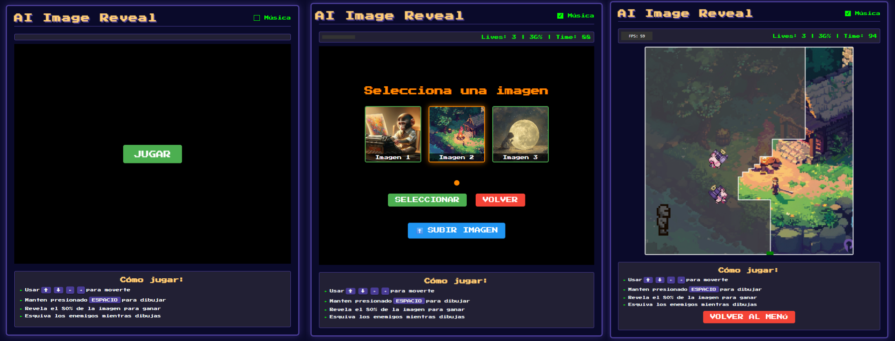

# AI Reveal Game

This minigame is similar to QIX (1981) and Gals Panic (1990), with a modern graphics supported for web.
With educative purpose, the images to reveal about IA

Example minigame : https://www.tiktok.com/@gamable.com/video/7502100629624573206

This minigame has coded, thanks to [LucasMetal](https://github.com/LucasMetal), with his repository [https://github.com/LucasMetal/larvs-panic](https://github.com/LucasMetal/larvs-panic).

## Screenshot

## Description about minigame

1. Two enemies type with random movement.
2. Upload custom image for play.
3. Two enemies balls deprecated (no visibly).
